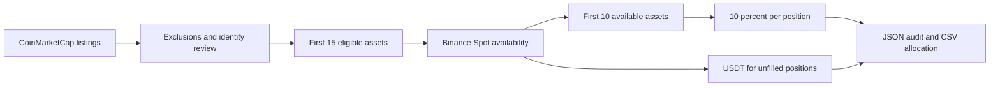

# Crypto Index Rebalancer

A Python research pipeline that turns CoinMarketCap rankings into an auditable, equal-weight crypto portfolio proposal using Binance Spot market availability.

**Status:** local prototype. A live preview has been exercised; production scheduling and trade execution are not deployed. [Guía en español](docs/GUIA.md).

## Problem and approach

Market rankings include stablecoins, wrapped assets and memecoins, and not every ranked asset can be traded on the target exchange. This project makes selection decisions explicit and reproducible: preserve provider responses, apply eligibility rules, validate market status and export a proposed allocation with an audit trail.



## Methodology

- Follow CoinMarketCap's circulating-market-cap ranking, not fully diluted valuation.
- Exclude stablecoins, wrapped or asset-linked tokens and memecoins before taking the first 15 eligible assets.
- Select the first 10 available on Binance Spot in ranking order. Do not search beyond the eligible top 15.
- Allocate 10% to each selected asset. Each unfilled position contributes 10% to USDT cash; do not redistribute it.
- Reconstitute and rebalance on the last calendar day of each month at 07:00 `America/Mexico_City`.

The current implementation uses CMC category tags plus a reviewed identity registry. Category labels are not a complete semantic classifier: an unfamiliar asset stops selection for review rather than being silently skipped. The registry does not freeze index membership; monthly ranks still determine membership.

Binance validation requires `status=TRADING` and `isSpotTradingAllowed=true`. A direct USDT pair enables the proposal. If a selected asset only has other quote currencies, the run requests route review instead of treating the asset as unavailable. Filters and permission sets are recorded but do not establish account eligibility, liquidity or executable order sizes.

## Local setup

Python 3.11 or newer is required. Run commands from the repository root.

Windows PowerShell:

```powershell
py -3 -m venv .venv
.\.venv\Scripts\python.exe -m pip install -e .
.\.venv\Scripts\python.exe -m unittest discover -s tests -v
.\.venv\Scripts\python.exe -m crypto_index.cli
```

Linux/macOS:

```sh
python3 -m venv .venv
.venv/bin/python -m pip install -e .
.venv/bin/python -m unittest discover -s tests -v
.venv/bin/python -m crypto_index.cli
```

The default download uses CoinMarketCap's public API and Binance public market data. No Binance API key is needed. Optional `CMC_API_KEY` can be supplied through the process environment; it switches to the authenticated CMC endpoint. Never commit credentials.

## Outputs and operating modes

Each preview writes a separate timestamped directory under `runs/`:

| File | Purpose |
|---|---|
| `report.json` | Status, eligibility, availability, allocation, timestamps and SHA-256 hashes |
| `portfolio.csv` | Proposed target weights, only when composition is ready |
| `cmc.json` / `binance.json` | Original downloaded responses |
| `registry.json` | Exact identity registry used by the run |

`composition_ready` means the composition checks passed, not that orders may be placed. `review_required` and `route_review_required` produce no portfolio. Invalid, stale or incomplete data fail the run rather than converting unknown availability into cash.

Exit codes: `0` for a ready composition or an out-of-window scheduled invocation; `1` for an error; `2` for review or a locked run. Inspect the message/report as well as the exit code.

```sh
python -m crypto_index.cli --scheduled
```

This flag is a calendar guard, not a scheduler. It accepts month-end invocations from 07:00 through 07:14 CDMX to allow operational retries. The target remains 07:00; a delayed capture is timestamped and is not represented as an exact 07:00 snapshot. Existing monthly reports are preserved. No catch-up with current data is attempted after the window. See the [operations guide](docs/GUIA.md) for limitations and recovery.

## Engineering decisions

- CMC IDs plus explicit Binance mappings instead of unreviewed symbol matching.
- Original source preservation and hashes for traceability; hashes prove file identity, not provider authenticity.
- Bounded network retries, 30-second request timeouts and source freshness checks.
- Calendar logic uses an IANA timezone and handles leap years and different month lengths.
- Exclusive run locks and an atomic final JSON report write.
- Deterministic offline unit tests; GitHub Actions configuration for Windows/Linux and Python 3.11/3.13. Remote CI has not yet been run.

## Scope and next milestones

This version builds a target composition. It does not place orders, access balances, size trades, estimate slippage, calculate historical returns or operate an ETF. The reviewed registry needs maintenance as new assets enter the ranking. CMC data older than 30 minutes or over two minutes in the future is rejected; the two source downloads must complete within two minutes of each other. A maximum of 500 ranked listings is requested, with failure if the eligible universe cannot be established.

Next milestones: local acceptance review, stronger provider/CLI integration tests, deployment scheduling, account-specific feasibility and a separate paper-trading layer. Performance claims require a separately validated historical or forward series.

## Project layout

```text
config/assets.json        Reviewed CMC identities and Binance mappings
src/crypto_index/cli.py   Download, selection, reporting and calendar guard
tests/test_index.py      Offline selection and calendar tests
docs/GUIA.md             Local walkthrough in Spanish
.github/workflows/        Future CI configuration
runs/                    Local data; excluded from Git
```

## References

- [CoinMarketCap public API](https://coinmarketcap.com/api/documentation/pro-api-reference/keyless-public-api)
- [Binance Spot API](https://github.com/binance/binance-spot-api-docs/blob/master/rest-api.md)
- [Binance trading filters](https://github.com/binance/binance-spot-api-docs/blob/master/filters.md)
